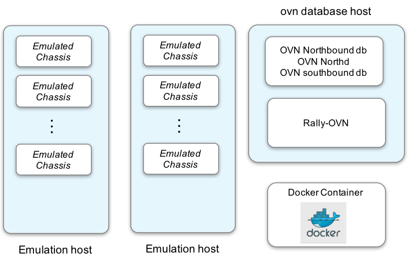

Ansible and Docker OVN Emulation Guide
======================================

Overview
--------

Deploy an OVN emulation environment using Docker container and ansible

**why using Docker?**

Docker allows deploying OVN emulation in a fast and consistent fashion.
Compiling OVS/OVN source is done once in one docker host, rather than
repetitively in every host. The same docker image will be distributed to all the
physical hosts by ansible.

High level view:

1. Deploy_ OVN emulation environment (docker and ansible)
2. Register_ the emulation environment in rally-ovs (another docker container)
3. Drive_ OVN workload by rally-ovs

Host machine requirements
-------------------------

The recommended emulation target requirements:

- 1 deploy node to run ansible and Rally workload
- 1 OVN database node
- 2 OVN chassis host to run emulated OVN chassis container
- 1 host to run rally container (could be the same as the OVN database node)

  
Installing Dependencies
-----------------------

The deploy node needs ansible. All the other nodes should have docker engine
installed. The following python package are required on all the nodes as well.

::

    pip install -U docker-py netaddr

Building OVN test Container Images
----------------------------------

To build containers, type

::

    cd ansible/docker
    make

These commands build two container images: ovn-scale-test-ovn and
ovn-scale-test-rally.

If you do not like the name, you can edit ansible/docker/Makefile to change the
image name.

Alternatively, there is a pre-built image in docker hub. To use it, run

::

    docker pull huikang/ovn-scale-test-ovn
    docker pull huikang/ovn-scale-test-rally

The remaining of this guide uses OVN-SCALE-TEST as the image name. You need to
change the name in your deployment.

Setup the emulation environment
-------------------------------
.. _Deploy:

Add hosts to the ansible inventory file

::

    ansible/inventory/ovn-hosts

The ansible node should be able to access the other nodes password-less. So ssh
key of the ansible node should be added to the other nodes.

Start by editing ansible/group_vars/all.yml to fit your testbed.

For example, to define the total number of emulated chasis in the network:

::

    ovn_db_image: "huikang/ovn-scale-test"
    ovn_chassis_image: "huikang/ovn-scale-test"
    ovn_number_chassis: 10

During deployment, these chassis will be evenly distributed on the emulation
hosts, which are defined in the inventory file.

OVN control containers can also be pinned to particular cores by setting the
following variables.

::

   north_db_cpu_set: "1"
   south_db_cpu_set: "2"
   northd_cpu_set: "3"

Deploying OVN Emulation
-----------------------

Run the ansible playbook

::

    ansible-playbook  -i ansible/inventory/ovn-hosts ansible/site.yml -e action=deploy

The above command deploys ovn control plane containers and the emulated chassis.
On the rally node, an ovn-rally container is also launched as well as the
deployment file and workload files.

Ansible allows you to overide the variables in group_vars/all.yml. For example,
some variables are defined in a separate file, named
/etc/new-nodes-variables.yml. To ask ansible to override the default variables,
run the playbook as follows:

::

    ansible-playbook  -i ansible/inventory/ovn-hosts ansible/site.yml -e @/etc/new-nodes-variables.yml -e action=deploy

The fastest way during evaluation to re-deployment is to remove the OVN
containers and re-deploy.

To clean up the existing emulation deployment,

::

    ansible-playbook  -i ansible/inventory/ovn-hosts ansible/site.yml -e action=clean

Registerring with Rally
-----------------------
.. _Register:

The ansible playbook deploys both the emulated chassises, the rally container,
along with rally deployment file. The rally deployment file is used to register
the ovn emulation environment in the rally database, like to [1].

::

   docker exec -it ovn-rally bash

The following commands are run in the ovn-rally container

::

   rally-ovs deployment create --file /root/rally-ovn/ovn-multihost-deployment.json --name ovn-multihost

The above command only registers the ovn emulation environment in the Rally
database.

To verify the deployment, in the ovn-rally container, type

::

   rally-ovs deployment list

   +--------------------------------------+----------------------------+---------------+------------------+--------+
   | uuid                                 | created_at                 | name          | status           | active |
   +--------------------------------------+----------------------------+---------------+------------------+--------+
   | a8d85fb4-c4ef-471b-ba11-cdb8885867d7 | 2016-05-02 16:47:34.278482 | ovn-multihost | deploy->finished | *      |
   +--------------------------------------+----------------------------+---------------+------------------+--------+

   rally-ovs deployment config

Register emulated sandboxes in the rally database

::

   rally-ovs task start /root/rally-ovn/workload/create-sandbox-${HOSTNAME}.json

NOTE: The name of the file above includes the hostname of the host itself.

Create sandboxes on multiple farm nodes
^^^^^^^^^^^^^^^^^^^^^^^^^^^^^^^^^^^^^^^

In the ansible inventory file, there could be multiple hosts in the
emulation-host section, e.g.,

::

   [emulation-hosts]
   9.47.161.24    provider_ip=9.47.161.24
   9.47.161.53    provider_ip=9.47.161.53

In this case, OVN sandboxes will be evenly distributed on these emulation hosts.
That is given "ovn_number_chassis: 200", each host will run 100 emulated
hypervisors.

In addition, to register the hosts and sandboxes in the rally-ovs database, the
create-sandbox task should be executed for individual farm nodes. Thanks to
ansible and jinja2, the create-sandbox will be automatically generated. As in
the above case, the following commands must be run in the **ovn-rally**
container.

::

   rally-ovs task start /root/rally-ovn/workload/create_sandbox-farm-node-1.json
   rally-ovs task start /root/rally-ovn/workload/create_sandbox-farm-node-2.json

Running Rally Workloads
----------------------
.. _Drive:

The following workload files will be automatically generated by ansible
deployment. The workload files are mounted into the rally container. These rally
workload should be run in the ovn-rally container.

::

   docker exec -it ovn-rally bash

**Note that workload parameters can be adjusted in two ways:** (1) "Rally
workload options" in ``ansible/group_vars/all.yml`` and (2) edit workload file
in the rally container.

- Create networks

::

   rally-ovs task start /root/rally-ovn/workload/create_networks.json

- Create networks(lswitches), lports, and list lports

::

   rally-ovs task start /root/rally-ovn/workload/create_and_list_lports.json

- Create networks, lports, and bind ports

::

   rally-ovs task start /root/rally-ovn/workload/create_and_bind_ports.json

- Create networks, lports, and acls

::

   rally-ovs task start /root/rally-ovn/workload/create_and_list_acls.json

To clean up the emulation environment, run

::

    ansible-playbook  -i ansible/inventory/ovn-hosts ansible/site.yml -e action=clean

References
----------
[1] http://rally.readthedocs.io/en/stable/tutorial/step_1_setting_up_env_and_running_benchmark_from_samples.html#registering-an-openstack-deployment-in-rally
