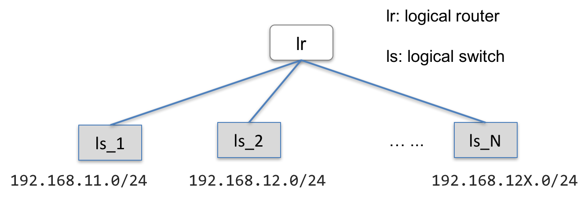
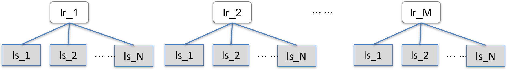

======================================
Logical Router Tasks in ovn-scale-test
======================================

Overview
========

Currently, ovn-scale-test supports logical router rally ovs tasks, e.g., 

* Create a single logical router that N logical switches connect to, each logical switch has one network

* Create M logical router; each one has N logical switches. In total, there are ``(N x M)`` networks.

* Based upon the above cases, creating ``K`` logical ports on each logical switch. In total, there are ``(K x N x M)`` logical ports.

By configuring N, M, and K, ovn-scale-test can generator different router-related workloads to the OVN control plane.

Task Configuration
==================

Configure the number of routers

::

    router_number: "1"

Configure the number of network for each router (i.e., ``N`` in above scenarios)

::

    networks_per_router: "1"

